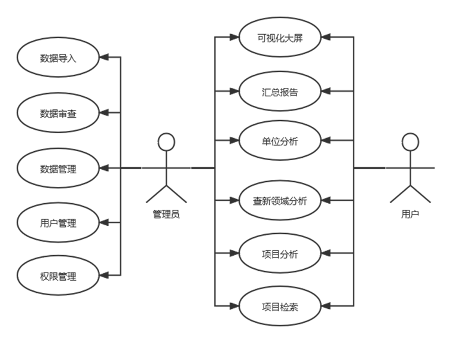
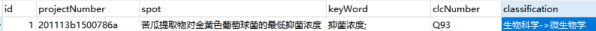
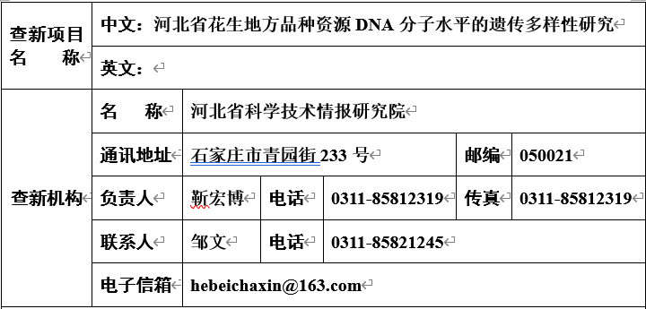
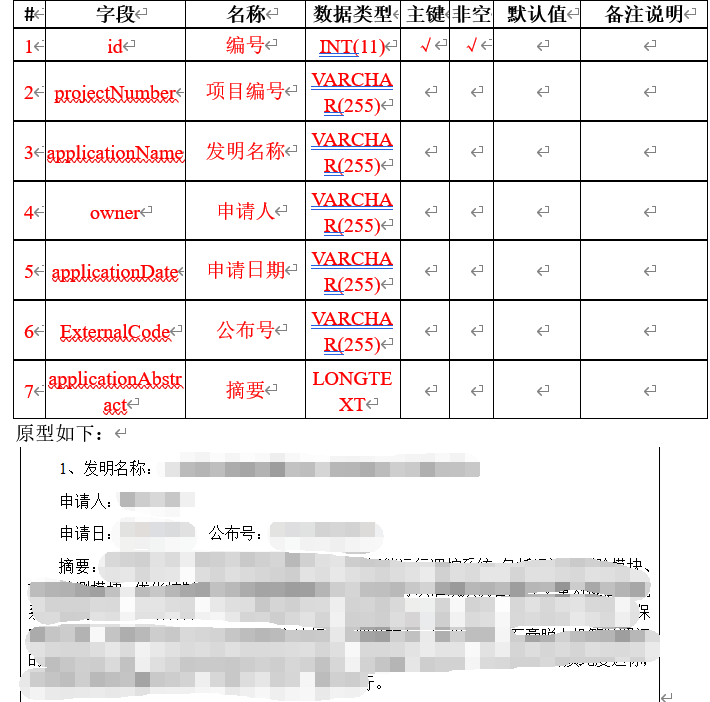
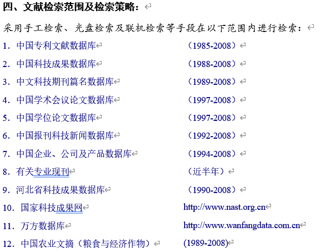
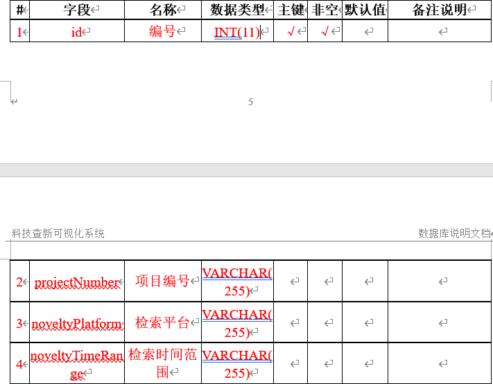

# 科技查新项目分析

## 1、系统总用例图

## 2、功能

1. 报告分析：时间、单位、地域
2. 单位分析：研究要点、创新活跃度、项目关键要素
3. 查新领域分析：（各地区研究重点-创新方向、企业性质-创新方向、查新领域-项目关联性）
4. 项目分析：各地区、各类型项目研究重点

## 3、数据表

### 3.1、查新点处理：

**查新点、关键词、学科分类**

### 3.2、科技查新报告

#### 1、查新机构信息

#### 2、查新检索结果

#### 3、查新范围表

#### 4、查新报告基本信息

委托人信息库（公司）

被委托人信息库

项目信息库

​	
