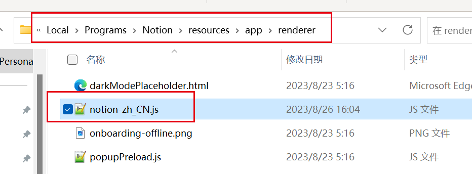
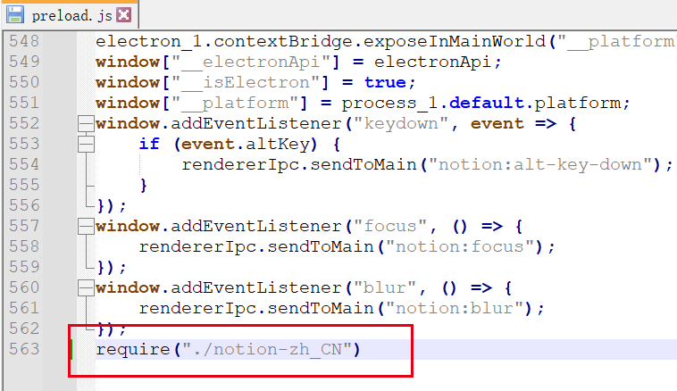

## Notion笔记汉化

----

关注我的订阅号【靠谱杨的挨踢生活】回复【Notion】获取中文包

**1、**进入notion的安装路径，把文件复制到这个位置（如图所示）

C:\Users\用户名\AppData\Local\Programs\Notion\resources\app\renderer



**2、**打开 `preload.js`

**3、**在最后一行加上

```javascript
require("./notion-zh_CN") 
```



**4、**重启notion即可
