# 1、项目结构

系统架构分为四个层次，分别为用户访问层、业务应用层、服务支撑层和数据存储层。用户层按用户的权限将用户分为三类，三类用户能够使用本系统的不同的功能。业务应用层主要包括科技政策查询，其中有政策文件查询、科技政策分类总览、科技政策知识图谱展示。科技政策分析中包括科技政策对比、演化和主题词分析以及智能问答，政策文件管理主要是政策类别管理。服务支撑层是该系统用到的主要方法，用来对数据进行加工。服务支撑层包括：文本自动分类、提取科技政策文本关键词、新词发现技术、知识图谱。数据存储层为系统提供数据，主要是保存科技政策文件的Mysql数据库和保存知识图谱的Neo4j数据库。

## 1.1、科技政策文件管理

### （1）科技政策查询

① 功能：用户根据自己的需要对科技政策进行检索和查看

② 输入数据：选择发布时间范围（可选），政策名称（可选），关键词（可选），发布单位（可选），全文检索（可选）。

③ 输出结果：根据用户选择的查询条件，输入的政策名称，选择的时间范围，政策的发布机构，科技政策包含的关键词或包含的内容，在表格中以分页的形式进行展示，展示顺序按照发布时间倒序排序，在表格中显示的内容包括政策名称，政策发布日期和政策发布机构。

④ 使用场景：用户知道某篇科技政策的具体或大概的名称，按照政策名称进行具体或模糊查询。想要寻找具体部门发布的科技政策，可以选择发布单位，按照单位条件进行内容检索。寻找包含某个关键词的科技政策可以按照关键词条件查找。

⑤ 解决方案：通过用户点击查询按钮来获取用户的输入，将获取的输入传入到后台的控制类中，将获取的数据进行整理后传递给MyBatis-plus中相应的mapper，动态的创建SQL语句，之后使用MyBatis-plus的分页查询查件，到数据库中进行查询，将查询的数据转换成json格式，传递给Layui的table元素，解析json数据后以表格进行展示。

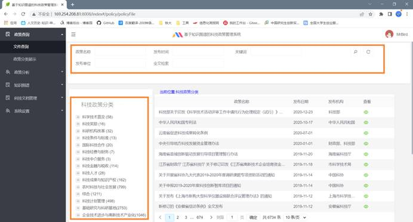

### （2）政策录入和标引

**录入和标引**

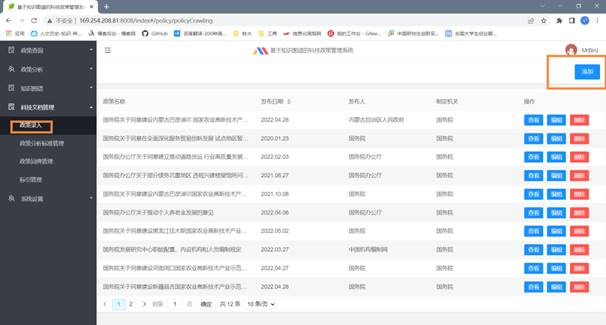

 

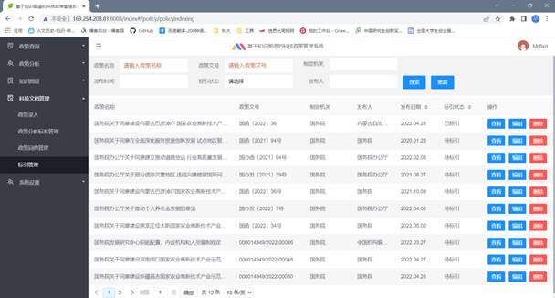

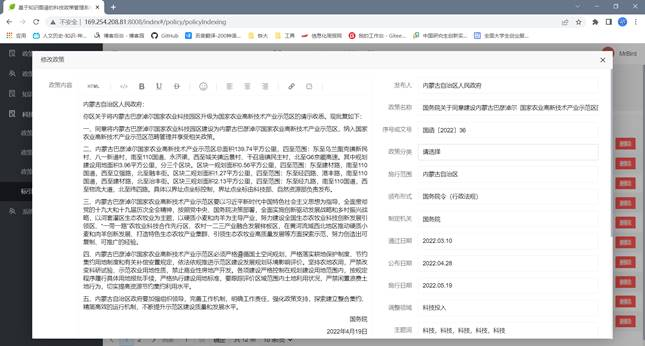

## 1.2、 科技政策分类总览

### （1）科技政策类别占比

① 功能：显示科技政策中不同类别所占的比例和具体数量。

② 输入数据：科技政策总数和科技政策每个类别的数量。

③ 输出结果：根据科技政策总数和科技政策每个类别的数量，经过计算得出比例并显示在饼状图和表格中。

④ 使用场景：显示出科技政策总数和不同类别的占比，直观告诉用户本系统拥有的科技政策数量和分布情况。

⑤ 解决方案：对采集到的科技政策进行自动文本分类，并将分类结果保存到MySQL数据库中，之后当用户进入到该功能时，自动从数据库中提取科技政策数据并进行计算，将计算结果转化为json数据格式后，将其传递到前端进行展示。

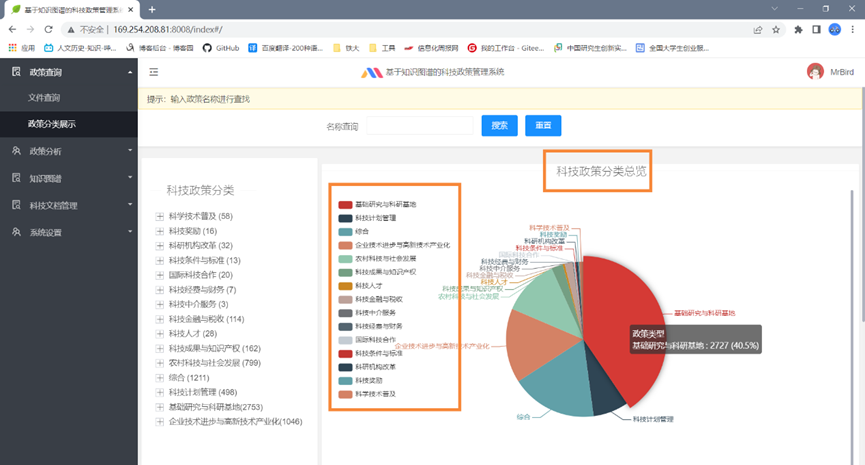

### （2）政策分类表格展示

① 功能：以表格形式展示出某类某级科技政策的信息，分页进行展示

② 输入数据：点击左侧政策分类栏中的信息，程序获取点击的数据

③ 输出结果：以表格分页的形式展示出该类的政策，表格中包含了科技政策的政策文件名和发布日期。

④ 使用场景：用户不需要太过精确的查询，只是想要大致了解该类政策的信息时，可以使用这项功能，不需要使用科技政策查询功能。

⑤ 解决方案：当用户点击一个政策类别时，获取该类别对应的信息传递到后台，之后以这个信息为查询条件进行数据库查询，将查询的数据转化为json数据格式并传到前台展示。

 

## 1.3、科技政策知识图谱

### 科技政策信息展示

① 功能：对科技政策的基础信息进行展示，同时对该科技政策的上位政策、下位政策和相似政策进行展示。

② 输入数据：用户在名称查询位置选择一个具体的科技政策，系统会在页面中展示出该科技政策的基础信息，和它的上位政策、下位政策和相似政策。科技政策的查询采用了类似百度的查询方式。

③ 输出结果：系统根据用户选择的科技政策，在界面上展示出该科技政策的基础信息，和它的上位政策、下位政策和相似政策，并以关系图的形式加以展示。

④ 使用场景：用户想要知道某个科技政策的基本信息和与它有关联的科技政策时，可以使用该功能。

⑤ 解决方案：将用户选择的科技政策传递给后台，按照科技政策名称进行查询，将查询结果转换成json格式返回到前台，并进行展示，使用Echarts进行关系图展示。

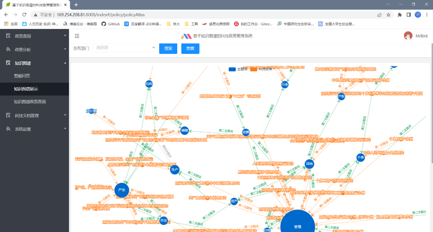

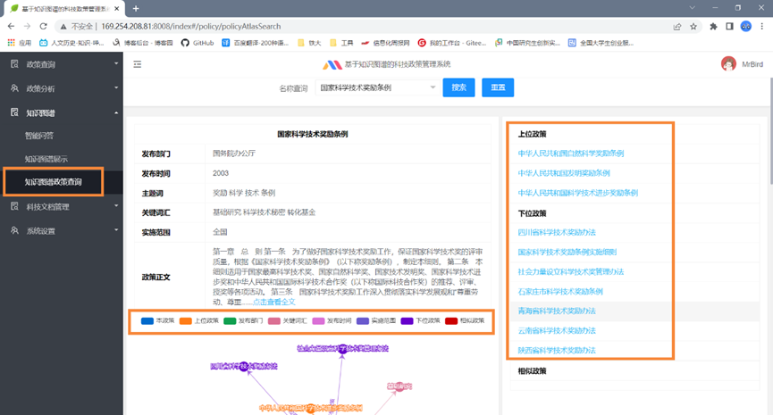

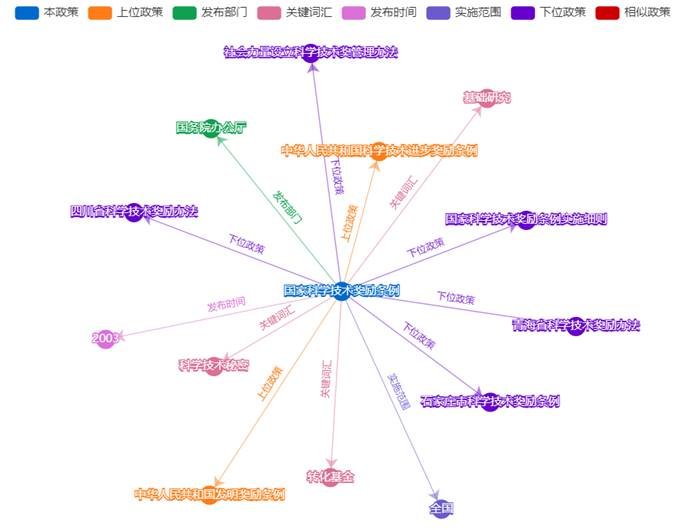 

## 2.3.4 科技政策分析

### （1）科技政策对比分析

① 功能：对同类科技政策进行对比分析，提取出科技政策内容的关键部分进行对比展示。

② 输入数据：用户点击左侧的科技政策分析，可以选择选中科技政策的具体名称或科技政策下的对比细节。

③ 输出数据：当用户选中的是科技政策的具体名称时，会显示出该科技政策的详细内容。当选中的是科技政策下的对比细节时，会显示出该类科技政策的对比内容，并对内容进行标红。

④ 使用场景：用户想要了解某类科技政策的不同点时，了解不同地区的科技政策的异同之处。

⑤ 解决方法：当用户选中具体名称时，会向后台传递该政策的名称，并按名称进行查询，将查询结果传递给前台进行展示。当用户选中的是对比细节时，会向后台传递该类别和细节，对该类科技政策进行查询和解析，之后将解析的结果进行展示。

### （2）科技政策演化分析

① 功能：以时间轴的方式展示出科技政策的演变趋势。

② 输入数据：用户选择某类科技政策的某个标准。

③ 输出结果：以时间轴的形式进行展示。

④ 使用场景：用户想要了解科技政策的变化历程和演变趋势。

⑤ 解决方案：将用户选中的信息传递给后台，后台进行数据库查询，并按时间倒序排列，对查询的数据进行解析，将解析后的结果返回到前台进行展示。

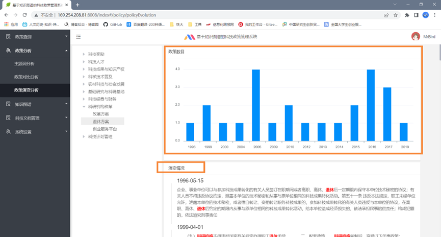

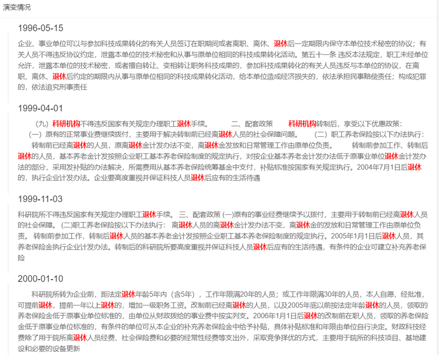

### （3）主题词分析

① 功能：对科技政策进行主题词分析，提取出科技政策的主题词。

② 输入数据：用户可以选择时间范围、科技政策的地域。

③ 输出结果：系统根据用户选择的查询条件进行查询，将查询到的结果进行统计，同时参考国务院公文主题词表，统计出某个主题词的频数和占比情况，并进行展示。

④ 使用场景：对一个地区或国家部门出台的科技政策，按照国务院公文主题词进行分析。可以判断科技政策中主题的占比情况。

⑤ 解决方案：根据国务院公文主题词，判断每篇科技政策中哪几个主题词出现的比重大，根据用户的选择，确定要分析的科技政策，对主题词的展示按照国务院公文主题词表进行展示。

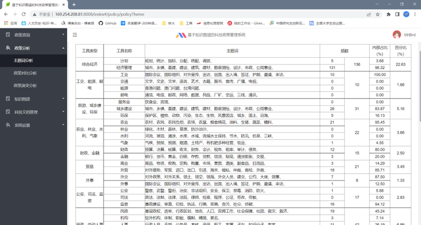

