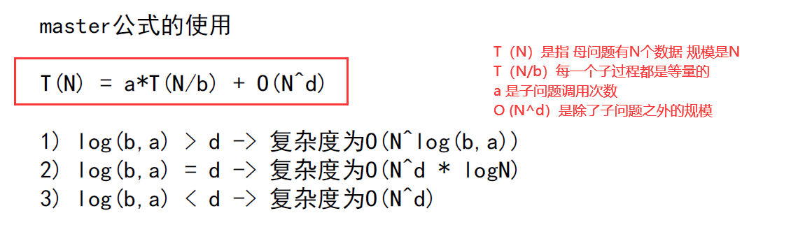

# Class01

## 01 冒泡排序

````java
public static void bubbleSort(int[] arr) {
		if (arr == null || arr.length < 2) {
			return;
		}
		for (int e = arr.length - 1; e > 0; e--) {
			for (int i = 0; i < e; i++) {
				if (arr[i] > arr[i + 1]) {
					swap(arr, i, i + 1);
				}
			}
		}
	}
````

### 交换位置方法（位运算）

```java
public static void swap(int[] arr, int i, int j) {
		arr[i] = arr[i] ^ arr[j];
		arr[j] = arr[i] ^ arr[j];
		arr[i] = arr[i] ^ arr[j];
	}
```

### 复制方法

```java
public static int[] copyArray(int[] arr) {
		if (arr == null) {
			return null;
		}
		int[] res = new int[arr.length];
		for (int i = 0; i < arr.length; i++) {
			res[i] = arr[i];
		}
		return res;
	}
```

### 判断相等方法

```java
public static boolean isEqual(int[] arr1, int[] arr2) {
		if ((arr1 == null && arr2 != null) || (arr1 != null && arr2 == null)) {
			return false;
		}
		if (arr1 == null && arr2 == null) {
			return true;
		}
		if (arr1.length != arr2.length) {
			return false;
		}
		for (int i = 0; i < arr1.length; i++) {
			if (arr1[i] != arr2[i]) {
				return false;
			}
		}
		return true;
	}
```


> 多使用方法封装功能
>
> 位运算快
>
> 多加if判断是否为null和数组长度范围

---

## 02 选择排序

```java
public static void selectionSort(int[] arr) {
		if (arr == null || arr.length < 2) {
			return;
		}
		for (int i = 0; i < arr.length - 1; i++) {
			int minIndex = i;
			for (int j = i + 1; j < arr.length; j++) {
				minIndex = arr[j] < arr[minIndex] ? j : minIndex;
			}
			swap(arr, i, minIndex);
		}
	}
```


1. minIndex = arr[j] < arr[minIndex] ? j : minIndex;

外层for循环 i 是选择出的那个下标，j从i之后的数据开始，向后遍历到尾部。

每次都去找比下标 i 位置还小的数的索引，然后交换！

其中 i 只需要到倒数第二个数，因为j是从 i 之后的一个数开始的！


## 03 插入排序

```java 
public static void insertionSort(int[] arr) {
		if (arr == null || arr.length < 2) {
			return;
		}
		for (int i = 1; i < arr.length; i++) {
			for (int j = i - 1; j >= 0 && arr[j] > arr[j + 1]; j--) {
				swap(arr, j, j + 1);
			}
		}
	}
```

为第 n+1 位置的数 向前遍历n个数据 寻找合适的位置插入！


## 04 二分法判断某个数是否存在

```java
public static boolean exist(int[] sortedArr, int num) {
		if (sortedArr == null || sortedArr.length == 0) {
			return false;
		}
		int L = 0;
		int R = sortedArr.length - 1;
		int mid = 0;
		while (L < R) {
			mid = L + ((R - L) >> 1);
			if (sortedArr[mid] == num) {
				return true;
			} else if (sortedArr[mid] > num) {
				R = mid - 1;
			} else {
				L = mid + 1;
			}
		}
		return sortedArr[L] == num;
	}
```

> 寻找中间位置的下标：
>
> int L = 0;
> int R = sortedArr.length - 1;
> int mid = 0;
>
> ==mid = L + ((R - L) >> 1);==
>
> 最后二分结束 不论是下标L还是下标R 效果都是一样的 所以最后return sortedArr[L] == num; 或者sortedArr[R] == num;都是可以的

## 05 二分法找满足>=value的最左位置

```java
	// 在arr上，找满足>=value的最左位置
	public static int nearestIndex(int[] arr, int value) {
		int L = 0;
		int R = arr.length - 1;
		int index = -1;
		while (L < R) {
			int mid = L + ((R - L) >> 1);
			if (arr[mid] >= value) {
				index = mid;
				R = mid - 1;
			} else {
				L = mid + 1;
			}
		}
		return index;
	}

```

## 06 提取某个不为0的数最右边的0

> int rightOne = eO & (~eO + 1);
>
> 这个数与上自己的 （取反再+1）！


-----

## 07 递归寻找数组最大值

```java
public static int getMax(int[] arr) {
		return process(arr, 0, arr.length - 1);
	}

	public static int process(int[] arr, int L, int R) {
		if (L == R) {
			return arr[L];
		}
		int mid = L + ((R - L) >> 1);
		int leftMax = process(arr, L, mid);
		int rightMax = process(arr, mid + 1, R);
		return Math.max(leftMax, rightMax);
	}
```

> 右移位运算>> 比 直接做除法 / 运算要快得多！




