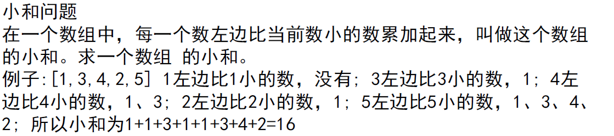

# 01【1,3,4,2,5】求小和



## 从右往左看：左边比右边小的加和到一起！

1	左边没有数	0

3	1

4	1+3

2	1

5	1+3+4+2

## 从左往右看：有几个数右边比左边大

1	4个数： 3 4 2 5		

3	2个数： 4 5

4	1个数： 5

2	1个数： 5

5	右边没有数	0

> 逆向思维：
>
> 一开始是计算左边比右边小的数的和
>
> 而后面的思路是看右边比左边大的数有几个
>
> 假如说第一个数是1 那么右边比1大的有4个数， **如果采用正向思维，那么一定会出现四个1相加，因为如果遍历一次后面的4个数，一定是每一次都要+1，因为对于这4个数来说，1 都是小于他们的！**
>
> 其他的数同理！
>
> 相当于正向思维是直接挨个相加，而逆向思维则是看每个需要加和的数出现了几次，通过看后面比这个数大的有几个，就可以确定它自身需要被加几次，然后做个乘法再做加法，这样得到的结果和正向走一遍是相同的！


```java
public static int smallSum(int[] arr) {
		if (arr == null || arr.length < 2) {
			return 0;
		}
		return mergeSort(arr, 0, arr.length - 1);
	}

	public static int mergeSort(int[] arr, int l, int r) {
		if (l == r) {
			return 0;
		}
		int mid = l + ((r - l) >> 1);
		return mergeSort(arr, l, mid) 
				+ mergeSort(arr, mid + 1, r) 
				+ merge(arr, l, mid, r);
	}

	public static int merge(int[] arr, int l, int m, int r) {
		int[] help = new int[r - l + 1];
		int i = 0;
		int p1 = l;
		int p2 = m + 1;
		int res = 0;
		while (p1 <= m && p2 <= r) {
			//只有当左侧的数据严格小于右侧数据的时候才可以求小和 在数据相等的时候必须先拷贝右边的数据 左边的指针不变！
			res += arr[p1] < arr[p2] ? (r - p2 + 1) * arr[p1] : 0;
			help[i++] = arr[p1] < arr[p2] ? arr[p1++] : arr[p2++];
		}
		while (p1 <= m) {
			help[i++] = arr[p1++];
		}
		while (p2 <= r) {
			help[i++] = arr[p2++];
		}
		for (i = 0; i < help.length; i++) {
			arr[l + i] = help[i];
		}
		return res;
	}
```

