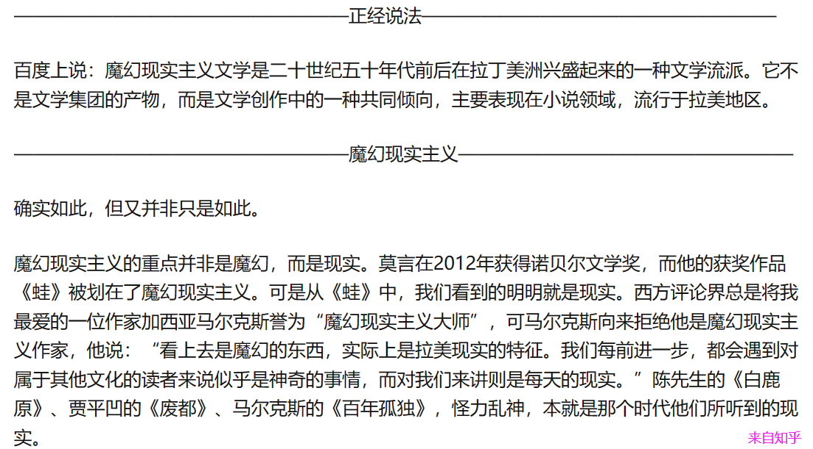
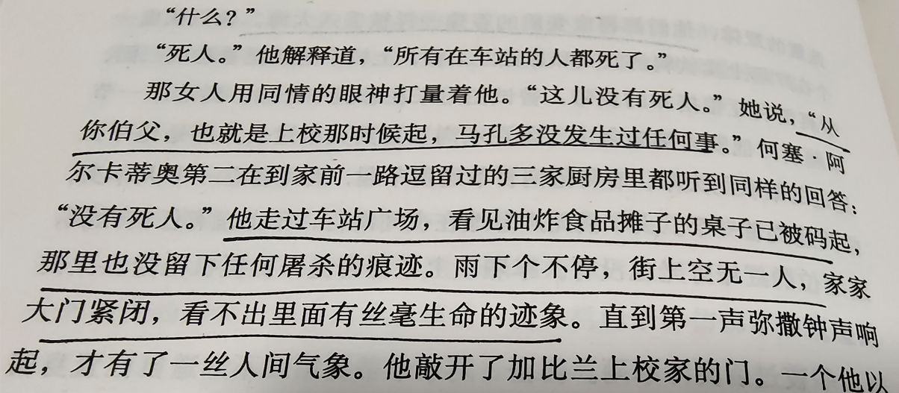
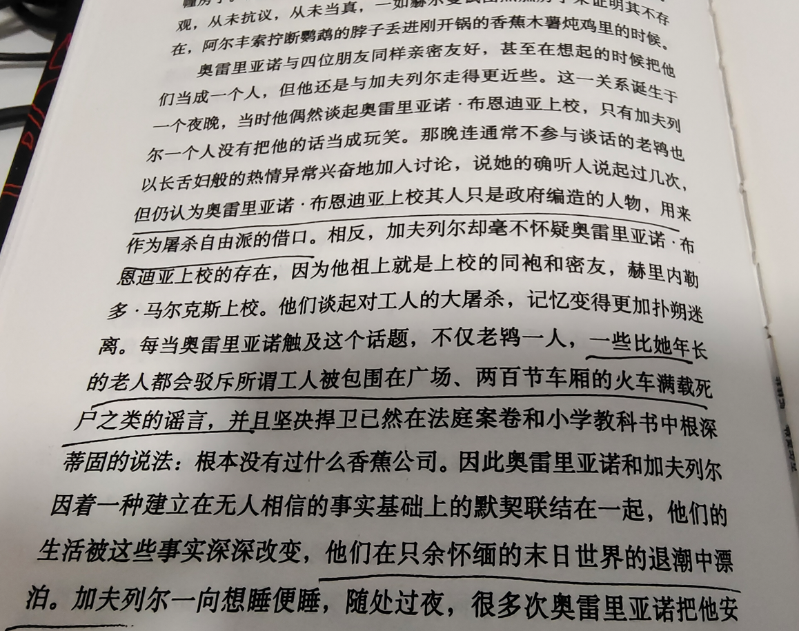
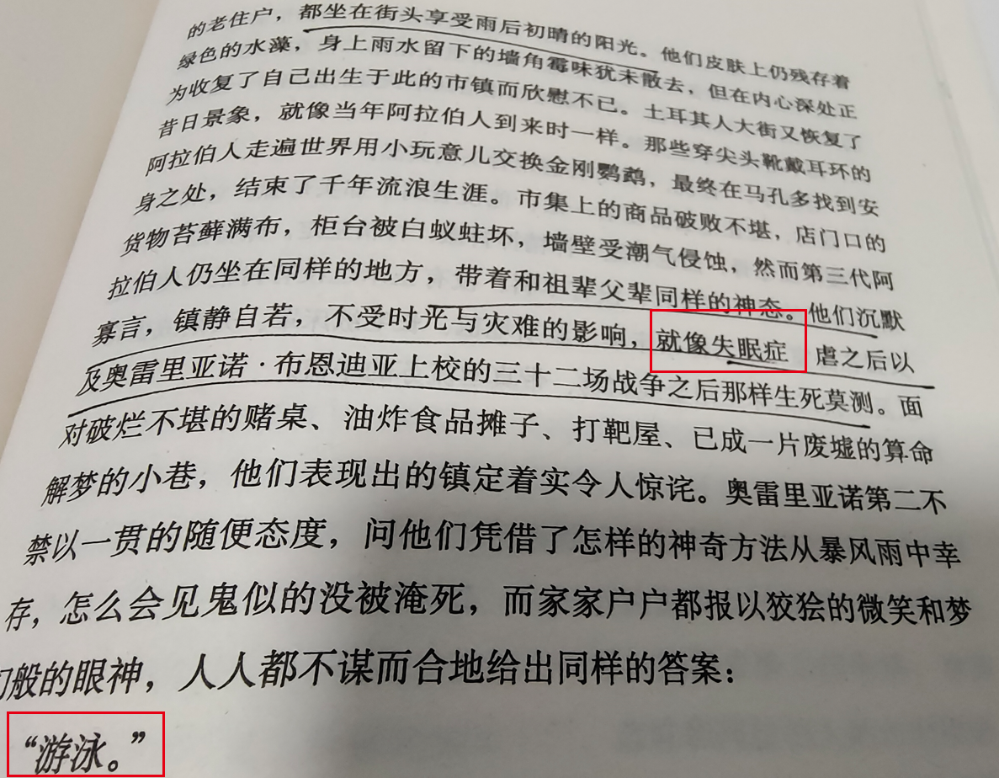
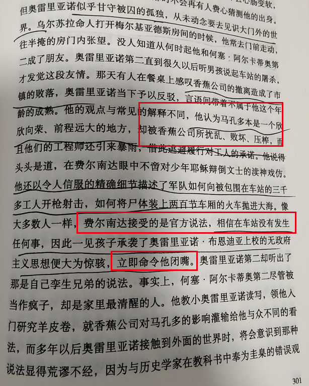
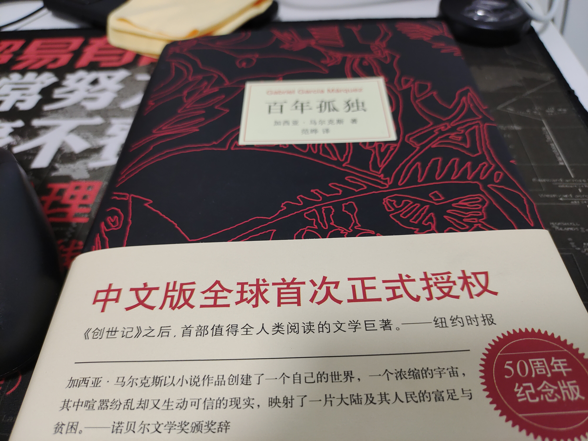

上校，马孔多在下雨...（加西亚·马尔克斯《百年孤独》）

---

《百年孤独》加西亚·马尔克斯 著   范晔 译

1、只要没有死人埋在地下，你就不属于这个地方。（12页）

2、失眠症最可怕之处不在于让人毫无倦意不能入睡，而是会不可逆转地恶化到更严重的境地：遗忘。（38页）

3、她是身影只出现在他心中，填满了他可怕的孤独。（57页）

4、他花了六个消失观察各种事物，试图找出一分一毫与前一天的不同之处，期待发现某种变化能证明时间的流逝。（69页）

5、他厌倦了战事无常，身陷这场永无休止的战争的恶性循环中总在原地打转，只不过一次比一次越发老迈，越发衰朽，越发不知道为何而战、如何而战、要战到何时。（148页）

6、他没有想到结束一场战争要比发动它艰难得多。（151页）

7、幸福晚年的秘诀，不过是与孤独签下不失尊严的协定罢了。（177页）

8、她似乎白天织晚上拆，却不是为了借此击败孤独，恰恰相反，为的是持守孤独。（227页）

9、热恋的焦灼只能在床上平息。（252页）

10、工人们厌倦了这些荒诞的诡辩，越过马孔多当局，直接上诉于最高法院。 在那里操纵法律的魔术师们证明**所有的指控都毫无效力**，因为香蕉公司没有，从未有过，也永远不会有任何正式工人，一直以来都是招募临时工。（262页）

11、马孔多没发生过任何事，现在没有将来也不会有。这是一座幸福的小城。（269页）

12、暴雨后的情形便是如此。人们一派懈怠，而遗忘却日益贪婪，无情地吞噬一点一滴的记忆。（298页）

13、原来时间也会出现失误和意外，并因此迸裂，在某个房间里留下永恒的碎片。（302页）

14、他不顾一切劝说执意要带上那三大箱文稿，甚至操着卡塔赫纳方言对建议托运的列车员恶言相向，最终他争得许可带着箱子一起登上了旅客车厢。“等到人类坐一等车厢而文学只能挤货运车厢的那一天，”他那时说道，“这个世界也就完蛋了。” （345页）

15、不论在什么地方都要记住，过去都是假的，回忆没有归路，春天总是一去不复返，最疯狂执着的爱情也终究是过眼云烟。（347页）

16、未来的不确定使他们的心绪回到了过去。（352页）

17、在一道清醒的电光中，他意识到自己的心灵承载不起这么多往事的重负。（358页）

在看完这本书之后，我特地去搜了一下魔幻现实主义是什么：书中有一些情景的描写明显是不符合我们对现实生活的认知的（比如美人儿蕾梅黛丝的飞升），因此被冠以“魔幻”二字。可尽管部分文字的描写是魔幻的，但这些其实对拉美人民来说，又是现实存在的，因为那就是他们曾经历的生活。魔幻现实是用一种魔幻的手法来讲述现实的事件。

​                                                              魔幻现实主义

这本书也许从拉美历史背景的角度来切入分析可能会更好一些。但是如果我也从这个角度去讲，可能大多是在复述很多人一些观点了。所以我打算换个角度，跳出这本书的历史圈子，去说一下我感受到的一点现实意义。

看完一本书，我习惯用几个词来概括一下最让我受触动的内容，或者说主题。对于这本书，我打算用**遗忘、回忆和孤独**这三个词来概括。

**遗忘对抗回忆，回忆对抗孤独，而遗忘也许才是真正的孤独。**

## 孤独是什么？

从物理层面上说，我们每个人都是独立的个体，我们生来孤独。

从环境层面上说，我们每个人多多少少都会伴随着社会属性，也就是社交。社交就意味着要让不同的个体之间产生联系，那么一个问题就来了，这种联系能建立到何种程度，如果我们不被周围的人理解，彼此无法建立联系甚至建立了错误的联系（出现误解），这可能就会成为孤独的来源之一吧。

*孤独是由外而内的，是一种不被人理解的状态；同时孤独也是由内而外的，是一种发自内心的孤独感。*

用别人的方式解释我们的生活，会让我们显得更加陌生而格格不入，我们只会感到更加孤独。

## 对抗孤独？享受孤独？

什么是对抗孤独？为什么说要享受孤独？不管从哪个角度来看，孤独大抵都会伴随每个人的一生，在这个漫长的过程中，我们需要对抗孤独也需要享受孤独。对抗孤独是一种斗争与探索的状态，而享受孤独是一种和解与折中的状态。

**对抗孤独**，最有效的也最美好的“一剂良药”也许就是爱情了。抛开其余先不谈，爱情本身是纯真而美好的。有人可能会说那还有友情和亲情呢？这说法不假，在我看来爱情也许比友情和亲情更加“来之不易”，狭义上的亲情是以血缘关系界定的，友情是一种爱情未满的状态。从另一个角度来讲，许多友情可能终其一生还只是友情。从友情到爱情是一次飞跃，而从爱情到亲情则是一次更大的飞跃。爱情可以让两个本互不相识、没有血缘而志趣相投的人彼此陪伴，走完一生，我想这应该算是爱情所谓伟大的一个表现吧。通读全书，不难发现作者马尔克斯对书中很多角色的性和爱情方面的描写着墨颇多。在创作完《百年孤独》这本旷世巨作之后，马尔克斯又创作出了另一部神作《霍乱时期的爱情》，而这本书的主题正是爱情。爱情是可遇而且大致也是可求的，这可能就上升到哲学问题了，我就不多说了。祝愿你我都可以找到属于自己的爱情。

**享受孤独**，我想最有效的方式就是记住过去并且心怀希望。回忆有时可以减轻孤独，而希望更是在孤独中的你我最重要的东西（当然回忆有时也会加深孤独，可如果在希望里回忆，可能会得到相反的效果吧）。我们应该用自己的思想来指挥自己的行动从而丰富自己的生活场景。享受孤独不应该是一种消极状态，而过分激进地选择对抗孤独也是不可取的。这和“穷则独善其身，达则兼济天下”这句话的含义有相通之处，反言之，独善其身也许仅是在为兼济天下做准备。哪怕终其一生他都没能兼济天下，至少在独善其身的过程中，他不是孤独的，他是充实的。还有一句话，1935年，毛主席在长征过程中摆脱国民党的围追堵截渡过金沙江后，在四川会理城说：为了进攻而防御，为了前进而后退，为了向正面而向侧面，**为了走直路而走弯路**。希望你我都能够拥有享受孤独和对抗孤独的能力，走过一条条弯路，最后找到属于我们的那条直路。

## 回忆和遗忘

正如我上面所说的，遗忘对抗回忆。这本书有一个让我非常震撼的主题，那就是人们对历史的遗忘，对侵略的熟视无睹，那是一种麻木的状态，那是拉美的悲哀。下面的图片是原著里和遗忘相关的一些段落，遗忘的可怕从中可见一斑。

​                                                       马孔多没发生过任何事

​                                    上校是编造出来的，火车上的死尸是谣言

​                                           好像一场雨就带走了侵略者的罪行

​                                                    唯一清醒的人却被命令闭嘴

作者马尔克斯在他的另一本书《活着是为了讲述》中提到，“生活不是我们活过的日子，而是我们记住的日子，我们为了讲述而在记忆中重现的日子。”

遗忘过去，是在背叛自己的生活，是对生活的漠视，是对历史的否定。我们总要记住些什么，不论是好的还是坏的，不论你是否愿意。有些事总需要有人记住的，如果你选择了遗忘，或者你被迫遗忘，那么当有一群人在极力地呼唤着这段记忆的时候，你依然有权保持沉默，但我希望你不要去命令他们闭嘴。

最后非常感谢B站up主**一只萧包子**，因为这本书人物众多，叙事比较平淡，再加上马尔克斯一贯“让人读不懂”的写作风格（给我的感觉貌似比《霍乱时期的爱情》更加晦涩），在我读到全书的四分之三的时候，几乎就读不下去了。然后我尝试去B站搜索一些相关的讲解视频，然后我就发现了这个宝藏up，刷完了他关于这本书的全部讲解视频，讲的很清楚分析也很到位，受益匪浅。这本书还是要找时间重读一遍的，至少对我来说（能力有限），读完一遍总还是感觉少点什么。

多年以后，不知身在何处的我将会回想起她和我坐在一起聊天，送我这本书的那个遥远的晚上。

我曾不止一次地表达，想和你一起读完一本书。如今这成为回忆，也成为未来。

我想引用电影《肖申克的救赎》里的两句我很喜欢的台词来做个结尾：

有种鸟是关不住的，它的每片羽毛上都洒满了自由的光辉。

Some birds aren't meant to be caged, that's all. Their feathers are just too bright...

记住，希望是件美好的事，也许是世间最美好的东西，而美好的事物永不消逝。

Remember, hope is a  good thing, maybe the best of things. And no good thing ever dies.

朋友，**昨天的今天就是未来。**

加油吧！

